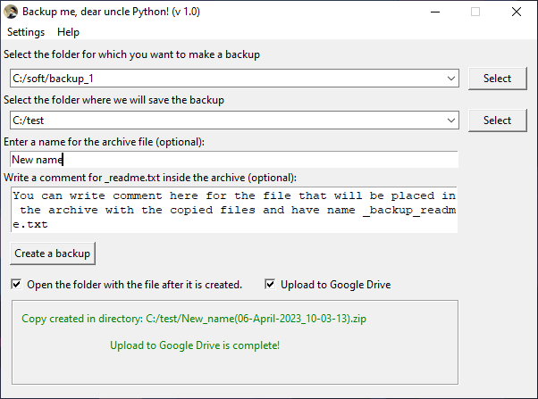

#  Backup me, dear uncle Python
Windows application for quickly creating backups on your computer. It is possible to run it from .exe file.  

  

## About this app
It allows you to quickly create an archive with a backup copy of the specified directory and put it in the right place on your hard disk.  

The name of the archive being created contains the date and time of its creation, if necessary, you can specify a prefix to the archive name

It is possible to write a text note, which is placed in the archive, in the form of a txt file.

You also can upload your backup file on Google Drive storage.

## How to install

If you want to compile this app to exe and have Google Drive uploading possibility
you should have Google Cloud account and have sercret json file (app_data/settings.yaml in this app)  

Read the [PyDrive documentation](https://pythonhosted.org/PyDrive/quickstart.html#authentication) 
for detailed instructions on how to get a json file.

If you got secret json file you must rename it to settings.yaml and execute first_time_encrypt.py. 
**Don't execute this script more than one time!** Because it will break you settings.yaml file.


```bash
git clone https://github.com/Vadimmmz/backup-me-dear-uncle-python.git
python -m venv env

# Activate virtual environment for Windows
source env/Scripts/activate

# Activate virtual environment fo for Linux
source env/bin/activate

# install all the libraries that are needed to work
pip install -r requirements.txt
```

## Used packages
This libraries was used:
- auto-py-to-exe==2.27.0
- PyDrive~=1.3.1
- google-api-python-client==1.8.0

## License

MIT License
